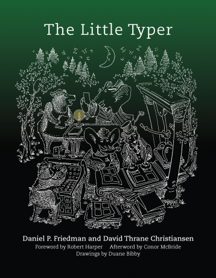

Examples and exercises from `The Little Typer`_.

Code is written in Pie_, a Racket_ dialect,
and can be executed using Docker Compose::

    $ docker-compose up

.. _The Little Typer: http://thelittletyper.com/
.. _Pie: https://github.com/the-little-typer/pie
.. _Racket: https://racket-lang.org/
