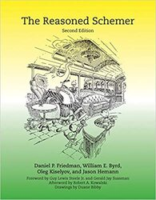

Examples and exercises from `The Reasoned Schemer`_ (Second Edition).

Code is written in Racket_, and can be executed using Docker Compose::

    $ docker-compose up

.. _The Reasoned Schemer: https://mitpress.mit.edu/books/reasoned-schemer-second-edition
.. _Racket: https://racket-lang.org/
